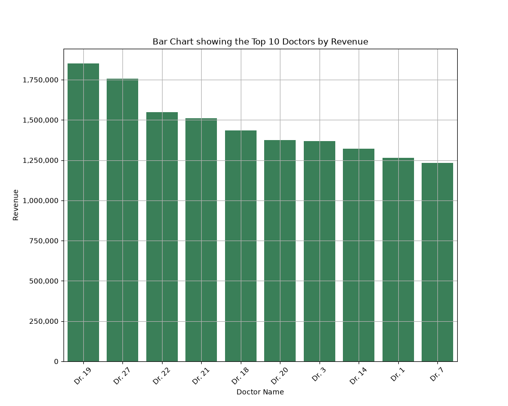
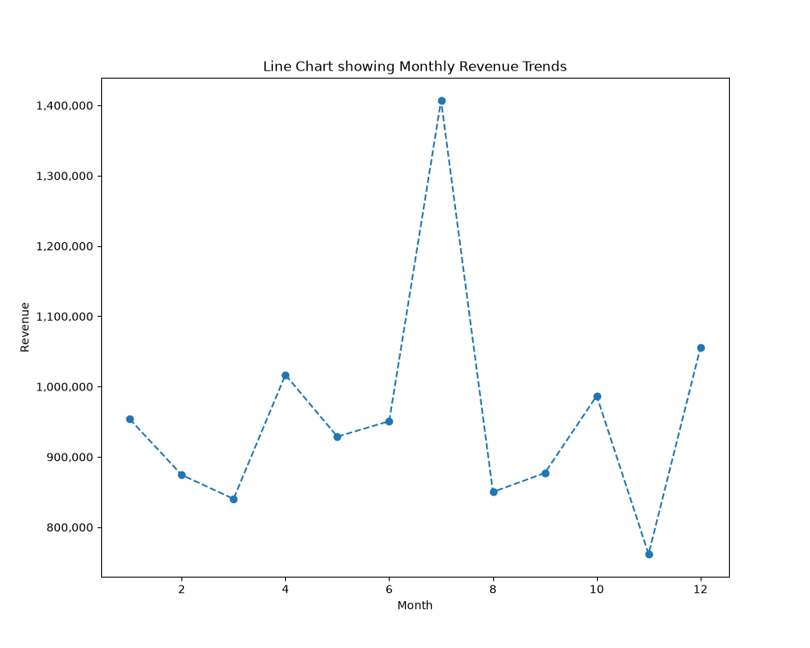

# Healthcare Data Analytics Project 🏥📊

A complete Python data analytics workflow — exploring, cleaning, integrating, analysing, and
visualising healthcare operational data for a multi-region hospital group, covering **January
2022 – December 2025**.

This project was completed as the final assignment for the **Python for Data Analysis** course
(Professional Careers Training and Recruitment), simulating a real-world consulting engagement
for a healthcare client operating across Cardiology, Orthopaedics, Neurology, Oncology, General
Medicine, and Paediatrics.

---

## 📌 Project Objective

The client needed answers to business questions across six areas:

- Hospital Performance
- Doctor Performance
- Treatment Performance
- Patient Activity
- Revenue Trends
- Regional Performance

This repository documents the end-to-end analytics workflow used to answer those questions,
from raw CSV files to a polished business report and chart set.

---

## 🗂️ Datasets

Six source datasets were provided and integrated into a single Master Dataset:

| Dataset | Description |
|---|---|
| `Appointments.csv` | Primary transaction table — all healthcare appointments |
| `Patients.csv` | Patient demographic information |
| `Doctors.csv` | Doctor details and medical specialties |
| `Hospitals.csv` | Hospital and region information |
| `Treatments.csv` | Treatments associated with each appointment |
| `Date_Table.csv` | Calendar / date dimension table |

---

## 🛠️ Tools & Libraries

- **Python 3**
- **Pandas** — data loading, cleaning, merging, aggregation
- **NumPy** — calculations and business analysis
- **Matplotlib** & **Seaborn** — data visualisation
- **openpyxl** — Excel export

---

## 🔄 Project Workflow

The project follows the five-stage workflow used by professional data analysts:

### Stage 1 — Data Exploration
Loaded and inspected all six datasets: shape, column names, data types, descriptive
statistics, missing values, and duplicate records.

### Stage 2 — Data Cleaning
- Converted date columns to `datetime`
- Handled missing values (`fillna()`, `dropna()`)
- Removed duplicate records
- Standardised inconsistent text formatting (`str.strip()`, `str.title()`)

### Stage 3 — Data Integration
Merged `Appointments`, `Patients`, `Doctors`, `Hospitals`, and `Treatments` on common keys into
a single **Master Dataset** (`healthcare_master_dataset.csv` / `.xlsx`).

### Stage 4 — Business Analysis
Used Pandas/NumPy filtering, grouping, and aggregation to answer key questions, including:
- Total appointments and total revenue
- Revenue by hospital, region, specialisation, and patient category
- Top 10 doctors and top 10 treatment types by revenue
- Revenue trends by year and by month

### Stage 5 — Data Visualisation
Produced professional charts to communicate findings:
- Bar chart — Top 10 Doctors by Revenue
- Bar chart — Revenue by Hospital
- Line chart — Monthly Revenue Trends
- Pie chart — Patient Category Distribution
- Histogram — Treatment Cost Distribution
- Correlation heatmap (Seaborn)

---

## 📈 Methodology Notes

- **Revenue** is calculated as `Consultation_Fee + Treatment_Cost` for each appointment.
- Missing values were handled contextually: categorical gaps (`Appointment_Type`, `City`) were
  filled with `"Unknown"`, while `Treatment_Cost` gaps were filled with the column median.
- Text columns across all six datasets were standardised using `.str.strip()` and `.str.title()`.
- Revenue was broken down by **Hospital**, **Region**, **Specialisation**, **Patient Category**,
  **Doctor**, **Treatment Type**, **Year**, and **Month**.

## 📈 Key Insights

> _Add 3–5 bullet points here summarising your actual findings, e.g.:_
- Highest-revenue hospital was **[Hospital Name]**, generating **£[amount]**
- **[Specialisation]** accounted for the largest share of total revenue
- Revenue peaked in **[Month/Year]**, driven by **[reason]**
- Top-performing doctor: **[Name]** with **£[amount]** in total revenue

---

## 🖼️ Sample Visualisations

> _Add screenshots of your charts here once exported, e.g._
```markdown


```

---

## 📁 Repository Structure

```
healthcare-data-analytics/
│
├── data/
│   ├── Appointments.csv
│   ├── Patients.csv
│   ├── Doctors.csv
│   ├── Hospitals.csv
│   ├── Treatments.csv
│   └── Date_Table.csv
│
├── ABI_Python_Project_Shubham_Choudhary.py
├── healthcare_master_dataset.csv
├── healthcare_master_dataset.xlsx
├── healthcare_business_report.xlsx
│
├── visualizations/
│   ├── top_10_doctors_revenue.png
│   ├── revenue_by_hospital.png
│   ├── monthly_revenue_trend.png
│   ├── patient_category_distribution.png
│   ├── treatment_cost_distribution.png
│   └── correlation_heatmap.png
│
├── requirements.txt
├── .gitignore
└── README.md
```

---

## ▶️ How to Run

```bash
# Clone the repository
git clone https://github.com/<your-username>/healthcare-data-analytics.git
cd healthcare-data-analytics

# Install dependencies
pip install -r requirements.txt

# Run the analysis
python ABI_Python_Project_Shubham_Choudhary.py
```

> Note: the script currently calls `plt.show()` for each chart, which pauses execution until
> the plot window is closed. If you want the script to run start-to-finish unattended (e.g. in
> a CI pipeline or headless environment), consider swapping `plt.show()` for
> `plt.savefig("visualizations/chart_name.png")` on each figure.

---

## 👤 Author

**Shubham Choudhary**
Trainee Data Analyst | Professional Careers Training and Recruitment
[LinkedIn](#) · [Portfolio](#) · [Email](#)

---

## 📄 Note

Datasets used in this project are for training purposes only and do not represent real
patient or hospital data.
